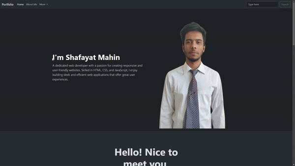

# Personal Portfolio

This is a personal portfolio website built using HTML, CSS, and Bootstrap. It showcases my skills, recent projects, and provides information about me as a web developer. The website is responsive and provides a clean, user-friendly interface to highlight my work and services.

## Demo

Check out the live demo [here](https://shafayat666.github.io/capstone-portfolio/).




## Features

- **Responsive Design**: Fully responsive layout, ensuring a seamless experience on all devices.
- **Modern UI/UX**: Clean, sleek design with a dark theme.
- **Bootstrap Framework**: Leveraging Bootstrap 5 for easy styling and responsive components.
- **Sections**:
  - **Header with Navigation**: Easy-to-navigate menu with responsive toggle for smaller devices.
  - **Hero Section**: Introducing myself with a professional profile image and a brief overview.
  - **About Me**: Personal background, strengths, and services I provide.
  - **Skills**: Showcasing key skills, tools, and frameworks I use.
  - **Projects**: Highlighting recent projects with an image carousel.
  - **Contact Me**: CTA section to encourage potential clients to reach out.
  - **Footer**: Links to social media and additional navigation.

## Technologies Used

- **HTML5**
- **CSS3**
- **Bootstrap 5.3**
- **JavaScript (Bootstrap components)**

## Getting Started

To run this project locally, follow these steps:

1. **Clone the repository**:
    ```bash
    git clone https://github.com/shafayat666/capstone-portfolio.git
    ```
2. Navigate to the project directory:
    ```bash
    cd capstone-portfolio
    ```
3. Open `index.html` in your browser.

## Usage

Feel free to use this template as a starting point for your own portfolio. You can customize the content, images, and styles to match your personal brand.


